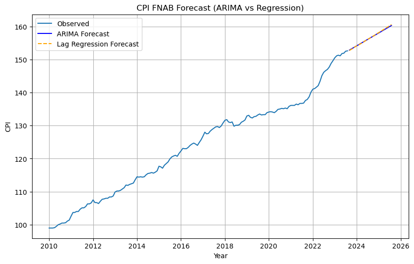
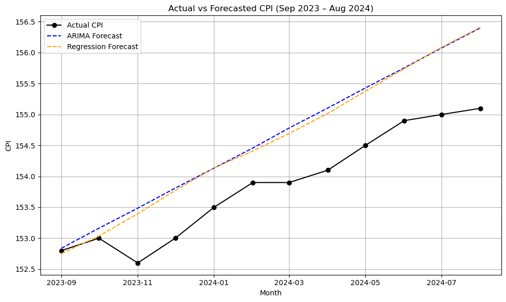

# CPI FNAB Forecasting (Malaysia)

This project forecasts the Consumer Price Index (CPI) for Food & Non-Alcoholic Beverages (FNAB) in Malaysia using both ARIMA modeling and lag-based regression with backward stepwise selection.

---

## Project Summary

- Compiled and analyzed monthly CPI data from Jan 2010 to Aug 2023.
- Modeled CPI using:
  - ARIMA(1,1,2) (Box-Jenkins method)
  - Lagged regression model using backward stepwise feature selection
- Forecasted CPI values 24 months ahead (Sep 2023 to Aug 2025).
- Validated forecast accuracy using actual CPI from Sep 2023 to Aug 2024.

---

## Objectives

1. To generate time series forecast models for Malaysia’s CPI (FNAB).
2. To determine the best model between ARIMA and univariate regression.
3. To forecast CPI values for 2 years ahead for planning and policy insights.

---

## Tools & Technologies

| Tool      | Purpose                                                  |
|-----------|----------------------------------------------------------|
| Python    | ARIMA modeling, regression, evaluation, visualization (`statsmodels`, `sklearn`, `matplotlib`) |
| R         | Original ARIMA modeling and visualization (`forecast`, `urca`, `ggplot2`) |
| Excel     | Raw data formatting                                      |

---

## Repository Structure

| File                                      | Description                                        |
|-------------------------------------------|----------------------------------------------------|
| `cpi_fnab_forecast_arima_regression.ipynb`| Main Python notebook with forecasts and evaluation |
| `cpi_fnab_arima_forecast.Rmd`            | Optional R Markdown version                        |
| `cpi_fnab.xlsx`                           | Monthly CPI dataset (2010–2023)                    |
| `README.md`                               | Project summary and documentation                  |

---

## Model Evaluation (Sep 2023 – Aug 2024)

| Metric        | ARIMA Forecast | Regression Forecast |
|---------------|----------------|---------------------|
| MAPE (%)      | 0.49           | 0.47                |
| RMSE          | 0.8368         | 0.8028              |
| Max % Error   | 0.84           | 0.84                |

Both models achieved strong forecasting performance. The regression model slightly outperformed ARIMA in error metrics, likely due to capturing autoregressive lag effects explicitly.

### Forecast Model Visualization

### Actual vs Forecasted CPI (Sep 2023 – Aug 2024)

The chart below shows actual CPI values compared to forecasted values from both ARIMA and regression models.

---

## Reference Paper

This forecasting project builds upon a scientific paper authored by the project owner and co-authors, presented at the MyStats 2024 Conference hosted by the Department of Statistics Malaysia (DOSM):

**Razali, W. A., et al. (2024). Predictive Analysis of Malaysia’s Food Price Index: An ARIMA Model Analysis.**
[View Full Paper (PDF)](https://www.dosm.gov.my/uploads/files/mystats-conference/2024/scientific-papers/20-Paper-Predictive-Analysis-of-Malaysias-Food-Price-Index-An-ARIMA-Model-Analysis.pdf)

The study focuses on ARIMA-based forecasting of Malaysia’s CPI for Food & Non-Alcoholic Beverages (FNAB), serving as the theoretical foundation for the current Python implementation and its extension with regression modeling.

---

## Future Improvements

- Incorporate external predictors (e.g., commodity prices, exchange rate) using multivariate time series methods.
- Extend the lag-based regression into a full autoregressive distributed lag (ARDL) framework.
- Evaluate alternative models such as SARIMA, Prophet, or LSTM for nonlinear dynamics.
- Deploy the forecasting model using a dashboard or API for real-time updates.
- Add confidence intervals to the regression forecast for better risk interpretation.

